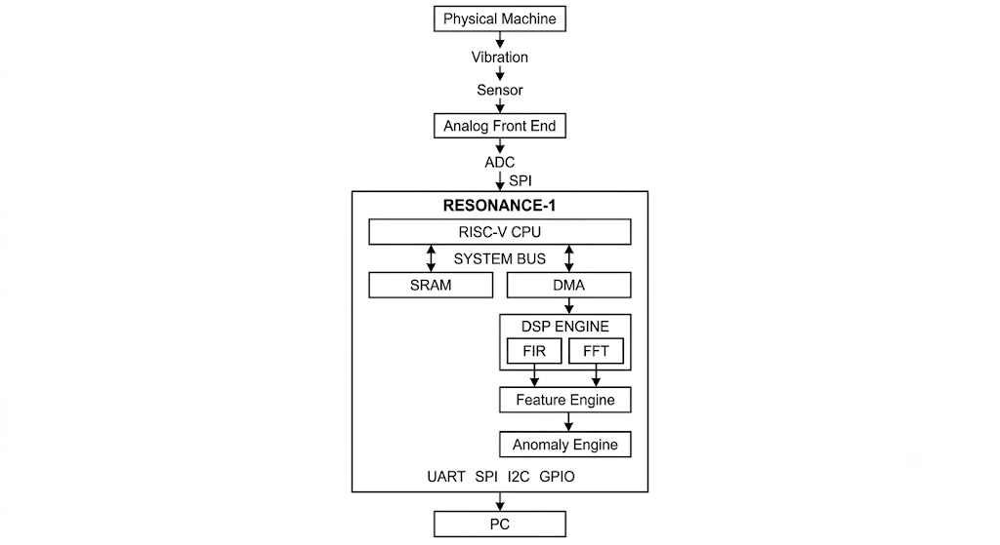
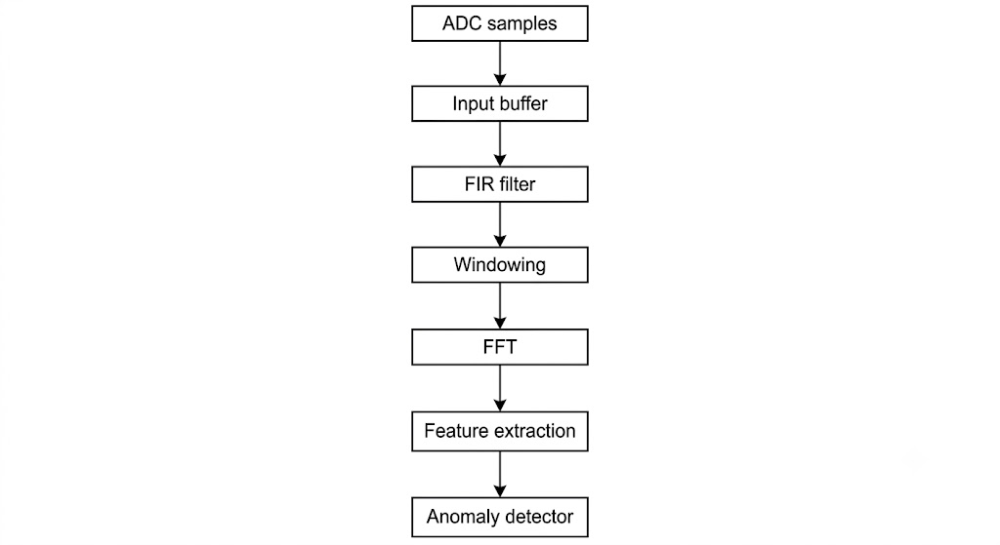

# RESONANCE-1 Architecture

## System

## DSP Data Path

## Software / Hardware Partition

Hardware:

- FIR
- FFT
- feature calculations
- high-throughput datapath

Software:

- system initialization
- configuration
- baseline management
- anomaly policy
- communication
- diagnostics

